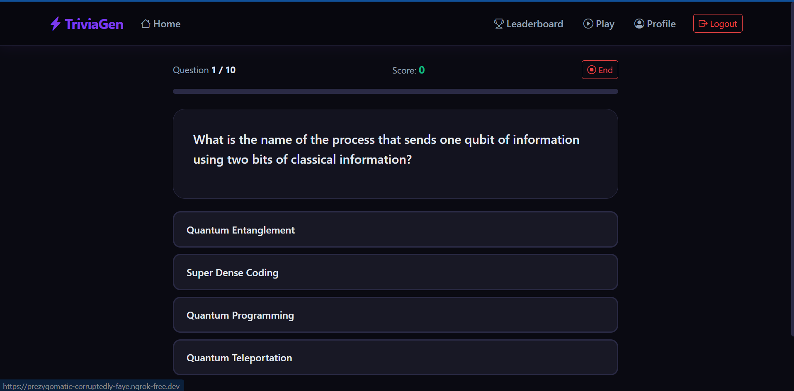

# TriviaGenerator

A trivia web app where you pick a category, answer questions, and compete for the top of the leaderboard.

<!-- Add a screenshot or GIF of the app here -->


**[Try the live demo →](https://prezygomatic-corruptedly-faye.ngrok-free.dev/)**

---

## Quick Start

1. Open the demo link above
2. Register an account (takes 10 seconds)
3. Choose your category, difficulty, and how many questions you want
4. Play and check your rank on the leaderboard when you're done

---

## Features

- **25+ trivia categories** — General Knowledge, History, Science, Video Games, Anime, and more, pulled from the Open Trivia Database
- **Flexible session setup** — choose category, difficulty (easy / medium / hard / any), question type (multiple choice or true/false), and question count
- **Real-time answer feedback** — every submission tells you if you were right and shows the correct answer
- **Persistent stats** — your correct answers and total questions accumulate across sessions
- **Leaderboard** — top 10 players ranked by questions answered or most correct answers

---

## Run It Locally
## Run It Locally

**Requirements**
- Java 17
- PostgreSQL 16
- Maven (or the included `./mvnw` wrapper)

**Setup**

1. Clone the repo and create a PostgreSQL database.

2. Set these environment variables:
```
POSTGRES_URL=jdbc:postgresql://localhost:5432/your_db
POSTGRES_USERNAME=your_user
POSTGRES_PASSWORD=your_password
JWT_SECRET=a-long-random-secret-string
```

3. Start the app:
```bash
./mvnw spring-boot:run
```

Visit `http://localhost:8080`.

---

## How It Works

Questions are fetched in bulk from the Open Trivia Database when a session starts, then served one at a time as you play. Fetching up front avoids an external API call on every question and keeps answer validation entirely server-side — the client never sees the correct answers before you submit.

Auth is handled with JWT via Spring Security. The token is issued on login, stored client-side, and validated by a filter on every protected route before it reaches a controller.

---

## Built With

- [Spring Boot 4.1](https://spring.io/projects/spring-boot) — backend framework
- [Thymeleaf](https://www.thymeleaf.org/) — server-side templates
- [Bootstrap 5.3](https://getbootstrap.com/) — UI styling
- [Spring Security](https://spring.io/projects/spring-security) + [JJWT](https://github.com/jwtk/jjwt) — authentication
- [Spring Data JPA](https://spring.io/projects/spring-data-jpa) + PostgreSQL — persistence
- [Open Trivia Database](https://opentdb.com/) — trivia question source
- [Lombok](https://projectlombok.org/) — boilerplate reduction

---

## Acknowledgements

Trivia data provided by [Open Trivia Database](https://opentdb.com/) (free, open, community-maintained).