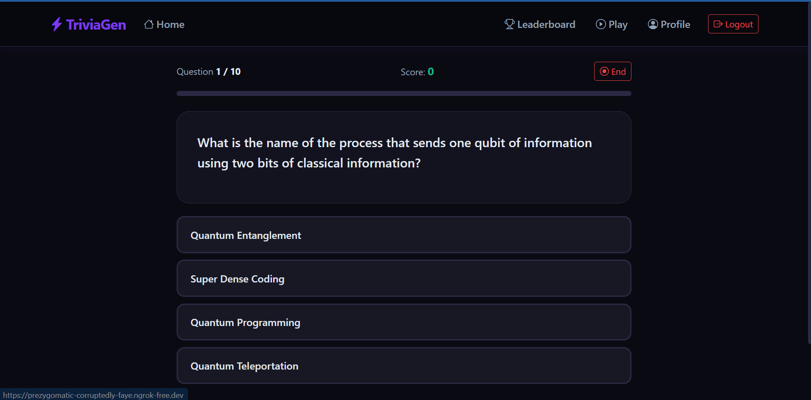

# TriviaGenerator

A Spring MVC website which allows users to test their knowledge through random trivia questions from many topics. 
<!-- Add a screenshot or GIF of the app here -->


**[Try the live demo →](https://stardance-frontend.tail5b0cb9.ts.net/)**

---

## How To Use

1. Go to https://stardance-frontend.tail5b0cb9.ts.net/ and create an account
2. Start a Trivia Session byt selecting the category, number of questions, and type of questions
3. Go through and answer the various trivia questions and watch your name climb the leaderboard

---

## Features

- JWT Authentication through a Username and Password Sign/Log in System
- Live Stats Tracking and a Global Leaderboard of all users
- Thousands of Trivia Questions from about 50 Categories
- Flutter frontend which mirrors a kahoot-like play style
---

## How To Run It Locally

**Requirements**
- Java (I used Java/ms 17)
- PostgreSQL(I used supabase)
- Maven (or the included `./mvnw` wrapper)(I just ran my project with Intellij IDEA for development)
- Docker
**Setup**

1. Clone the repo and create a PostgreSQL database(I used supabase).

2. Set these environment variables:
```
POSTGRES_URL=jdbc:postgresql://localhost:5432/your_db
POSTGRES_USERNAME=your_user
POSTGRES_PASSWORD=your_password
JWT_SECRET=a-long-random-secret-string
```

3. Start the app:
```bash
./mvnw spring-boot:run
```

4. Cd into the frontend folder and run 
``docker build .``
``docker compose up``

5. Go to http://localhost:{selected port} on your machine

---


## Tools

- Spring MVC
- Tailscale Funnel(Self-Hosting)
- Thymleaf template engine
- [Open Trivia Database](https://opentdb.com/) for the trivia questions

 